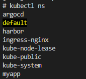

# minikube-harbor
minikube上でHarborを構築

## 参考
https://qiita.com/ysakashita/items/12e2f1e902ca5cbd56ed

## 環境
```
# uname -r
3.10.0-1160.el7.x86_64
```

```
# minikube version
minikube version: v1.21.0
commit: 76d74191d82c47883dc7e1319ef7cebd3e00ee11
```

NodeのIPは、10.1.1.200
```
# ifconfig 
eth0: flags=4163<UP,BROADCAST,RUNNING,MULTICAST>  mtu 1500
        inet 10.1.1.200  netmask 255.255.255.0  broadcast 10.1.1.255
        inet6 fe80::6713:7817:6317:b77e  prefixlen 64  scopeid 0x20<link>
        ether 00:15:5d:01:10:43  txqueuelen 1000  (Ethernet)
        RX packets 977251  bytes 1192902700 (1.1 GiB)
        RX errors 0  dropped 0  overruns 0  frame 0
        TX packets 284034  bytes 75827329 (72.3 MiB)
        TX errors 0  dropped 0 overruns 0  carrier 0  collisions 0
```

ingress を使用不可にしている
```
# minikube addons list 
|-----------------------------|----------|--------------|
|         ADDON NAME          | PROFILE  |    STATUS    |
|-----------------------------|----------|--------------|
| ambassador                  | minikube | disabled     |
| auto-pause                  | minikube | disabled     |
| csi-hostpath-driver         | minikube | disabled     |
| dashboard                   | minikube | disabled     |
| default-storageclass        | minikube | enabled ✅   |
| efk                         | minikube | disabled     |
| freshpod                    | minikube | disabled     |
| gcp-auth                    | minikube | disabled     |
| gvisor                      | minikube | disabled     |
| helm-tiller                 | minikube | disabled     |
| ingress                     | minikube | disabled     |
| ingress-dns                 | minikube | disabled     |
| istio                       | minikube | disabled     |
| istio-provisioner           | minikube | disabled     |
| kubevirt                    | minikube | disabled     |
| logviewer                   | minikube | disabled     |
| metallb                     | minikube | disabled     |
| metrics-server              | minikube | disabled     |
| nvidia-driver-installer     | minikube | disabled     |
| nvidia-gpu-device-plugin    | minikube | disabled     |
| olm                         | minikube | disabled     |
| pod-security-policy         | minikube | disabled     |
| registry                    | minikube | disabled     |
| registry-aliases            | minikube | disabled     |
| registry-creds              | minikube | disabled     |
| storage-provisioner         | minikube | enabled ✅   |
| storage-provisioner-gluster | minikube | disabled     |
| volumesnapshots             | minikube | disabled     |
|-----------------------------|----------|--------------|
```

## 手順

1. Ingress Controllerのセットアップ

    ```
    # kubectl apply -f https://raw.githubusercontent.com/kubernetes/ingress-nginx/controller-v1.8.1/deploy/static/provider/cloud/deploy.yaml
    ```

1. KubernetesのNodeのIPをExternal IPとして利用します。ServiceのManifest(service-nodeport.yaml)をデプロイします。

    ```
    # kubectl apply -f service-nodeport.yaml
    ```

1. デプロイされたIngress Controllerを確認します。

    ```
    # kubectl get pod -n ingress-nginx
    ```

    ```
    # kubectl get svc -n ingress-nginx
    ```

1. HarborをデプロイするNamespaceを作成します。

    ```
    # kubectl create ns harbor
    ```


    ~~# kubens harbor~~ 

1. Harborのデータを格納するPersistentVolume(PV)のセットアップ

    KubernetesのNodeにログインしLocal Volumeの準備をします。以下の実行例ではkKubernetesのNodeにLocal Volumeのマウント先であるディレクトリ(/mnt/disks/vol1 ... vol5)を作成します。

    ```
    # mkdir -p /mnt/disks/vol{1..5}
    ```

    ```
    # chmod 777 /mnt/disks/vol{1..5}
    ```

    ```
    # ll /mnt/disks/
    ```

1. Harborで必要となるchartmuseum, database, job service, redistribution, registry用のPV、PVCを作成し、pv-pv-manifestfiles に格納し、デプロイする

    ```
    # ls pv-manifestfiles/ -1
    chartmuseum.pv.yaml
    chartmuseum.pvc.yaml
    database.pv.yaml
    database.pvc.yaml
    jobservice.pv.yaml
    jobservice.pvc.yaml
    redis.pv.yaml
    redis.pvc.yaml
    registry.pv.yaml
    registry.pvc.yaml
    ```

    ```
    # kubectl apply -f pv-manifestfiles/ -n harbor
    ```

    PV、PVCの確認
    ```
    # kubectl get pv,pvc -n harbor 
    NAME                              CAPACITY   ACCESS MODES   RECLAIM POLICY   STATUS   CLAIM                      STORAGECLASS    REASON   AGE
    persistentvolume/chartmuseum-pv   5Gi        RWO            Delete           Bound    harbor/chartmuseum-claim   local-storage            15s
    persistentvolume/database-pv      1Gi        RWO            Delete           Bound    harbor/database-claim      local-storage            15s
    persistentvolume/jobservice-pv    1Gi        RWO            Delete           Bound    harbor/jobservice-claim    local-storage            15s
    persistentvolume/redis-pv         1Gi        RWO            Delete           Bound    harbor/redis-claim         local-storage            14s
    persistentvolume/registry-pv      5Gi        RWO            Delete           Bound    harbor/registry-claim      local-storage            14s

    NAME                                      STATUS   VOLUME           CAPACITY   ACCESS MODES   STORAGECLASS    AGE
    persistentvolumeclaim/chartmuseum-claim   Bound    chartmuseum-pv   5Gi        RWO            local-storage   15s
    persistentvolumeclaim/database-claim      Bound    database-pv      1Gi        RWO            local-storage   15s
    persistentvolumeclaim/jobservice-claim    Bound    jobservice-pv    1Gi        RWO            local-storage   14s
    persistentvolumeclaim/redis-claim         Bound    redis-pv         1Gi        RWO            local-storage   14s
    persistentvolumeclaim/registry-claim      Bound    registry-pv      5Gi        RWO            local-storage   14s
    ```


1. kubens のインストール

    - ここまでの手順では、kubens を使用していなかったが、元の手順ではデフォルト（未指定時）のnammespaceをkubens harbarに設定しているようなので、kubens をインストールする

    - kubectx も併せてインストールする

    以下のサイトを参考にした
    https://qiita.com/prodigy413/items/8db33f731476540e654f

    1. krew 設定

        1. 以下コマンド実行で krew インストール

        ```
        (
        set -x; cd "$(mktemp -d)" &&
        OS="$(uname | tr '[:upper:]' '[:lower:]')" &&
        ARCH="$(uname -m | sed -e 's/x86_64/amd64/' -e 's/\(arm\)\(64\)\?.*/\1\2/' -e 's/aarch64$/arm64/')" &&
        KREW="krew-${OS}_${ARCH}" &&
        curl -fsSLO "https://github.com/kubernetes-sigs/krew/releases/latest/download/${KREW}.tar.gz" &&
        tar zxvf "${KREW}.tar.gz" &&
        ./"${KREW}" install krew
        )
        ```

    1.  PATH追加

        ```
         # vi ~/.bashrc
        ```

        以下を追加
        ```
        export PATH="${KREW_ROOT:-$HOME/.krew}/bin:$PATH"
        ```

        修正内容を確認
        ```
        # cat ~/.bashrc 
        ```

    1. シェルの再起動

        ```
        # exec $SHELL -l
        ```

    1. krewのインストール正否確認

        ```
        # kubectl krew
        ```

        ```
        krew is the kubectl plugin manager.
        You can invoke krew through kubectl: "kubectl krew [command]..."
        ..........
        ```
    1. kubectx のイントール

        ```
        # kubectl krew install ctx
        ```

        - 2023-08-12現在、contextの使い方が分からないため、インストールのみ実施

        - 以下のような警告メッセージが出力されたが、とりあえずこのままとする。

        ```
        # kubectl krew install ctx
        Updated the local copy of plugin index.
        Installing plugin: ctx
        Installed plugin: ctx
        \
        | Use this plugin:
        |      kubectl ctx
        | Documentation:
        |      https://github.com/ahmetb/kubectx
        | Caveats:
        | \
        |  | If fzf is installed on your machine, you can interactively choose
        |  | between the entries using the arrow keys, or by fuzzy searching
        |  | as you type.
        |  | See https://github.com/ahmetb/kubectx for customization and details.
        | /
        /
        WARNING: You installed plugin "ctx" from the krew-index plugin repository.
        These plugins are not audited for security by the Krew maintainers.
        Run them at your own risk.        
        ```

    1. kubens のインストール

        ```
        # kubectl krew install ns
        ```

        - 以下のような警告メッセージが出力されたが、とりあえずこのままとする。

        ```
        # kubectl krew install ns
        Updated the local copy of plugin index.
        Installing plugin: ns
        Installed plugin: ns
        \
        | Use this plugin:
        |      kubectl ns
        | Documentation:
        |      https://github.com/ahmetb/kubectx
        | Caveats:
        | \
        |  | If fzf is installed on your machine, you can interactively choose
        |  | between the entries using the arrow keys, or by fuzzy searching
        |  | as you type.
        | /
        /
        WARNING: You installed plugin "ns" from the krew-index plugin repository.
        These plugins are not audited for security by the Krew maintainers.
        Run them at your own risk.
        ```
        - 正常動作を確認。namespace変更確認

            ※黄色のnamespaceが使用中のnamespace

            

1. namespaceを harbor に設定

    ```
    # kubectl ns kubens
    ```

    以下のメッセージが返ってくればOK
    ```
    Context "minikube" modified.
    Active namespace is "harbor".
    ```


1. Harborのデプロイ

    ホームディレクトリに移動
    ```
    # cd ~
    ```

    始めにGitHubからharbor-helmをダウンロードします。
    ```
    # git clone https://github.com/goharbor/harbor-helm.git
    ```
